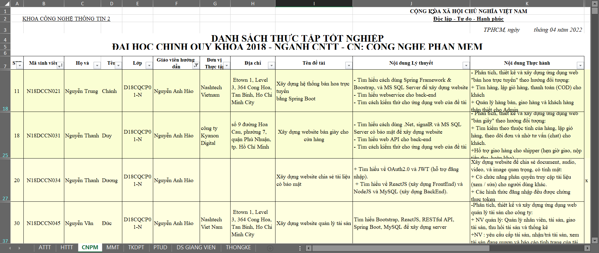
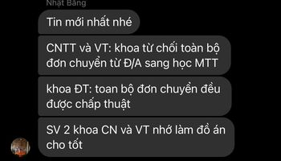
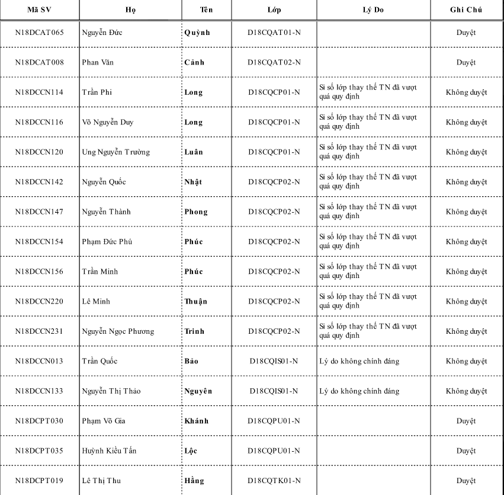
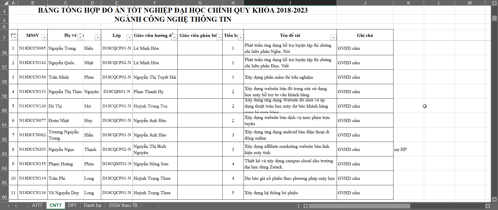

<h1 align="center">Học viện Công nghệ Bưu chính Viễn thông - Cơ sở TP.HCM 
    Tất cả những điều nên biết trước khi bước vào kì Thực tập và Đồ án tốt nghiệp Đại học
</h1>

    

# [**Table Of Content**](#table-of-content)
- [**Table Of Content**](#table-of-content)
- [**Introduction**](#introduction)
- [**Internship period**](#internship-period)
  - [**Middle of May to End of June**](#middle-of-may-to-end-of-june)
  - [**Start of July to End of August**](#start-of-july-to-end-of-august)
  - [**End of August to Early September**](#end-of-august-to-early-september)
  - [**The rest of September**](#the-rest-of-september)
- [**Graduation period**](#graduation-period)
  - [**Select your graduation appoach**](#select-your-graduation-appoach)
  - [**Compare between Graduation Project and Graduation Learning**](#compare-between-graduation-project-and-graduation-learning)
  - [**Receive graduation project's topic**](#receive-graduation-projects-topic)
  - [**If you fall, you will be in a dilemma**](#if-you-fall-you-will-be-in-a-dilemma)
  - [**Defend your graduation project with the highest council**](#defend-your-graduation-project-with-the-highest-council)
    - [**Before the very day**](#before-the-very-day)
    - [**For instance**](#for-instance)
    - [**More example**](#more-example)
    - [**In the very day**](#in-the-very-day)
    - [**After the very day**](#after-the-very-day)
  - [**The council**](#the-council)
    - [**Subcommittee 1**](#subcommittee-1)
    - [**Subcommittee 2**](#subcommittee-2)
    - [**Subcommittee 3**](#subcommittee-3)
    - [**Subcommittee 4**](#subcommittee-4)
    - [**Subcommittee 5**](#subcommittee-5)
    - [**Subcommittee 6**](#subcommittee-6)
- [**Document**](#document)
- [**Post Script**](#post-script)
- [**From Phong with love 💙**](#from-phong-with-love-)

# [**Introduction**](#introduction)
Chào các bạn đang đọc những dòng lưu bút đầu tiên này. Mình tên là Nguyễn Thành Phong. Thời điểm mình viết những dòng này thì có 
lẽ mình cũng được coi là cựu sinh viên trường rồi chỉ là chưa có bằng tốt nghiệp chính thức thôi. Như tiêu đề các bạn đã đọc ở bên trên,
 repository này **không nói về đồ án nào hết** mà tập trung vào **quá trình làm đồ án cho kì Thực tập & Đồ án tốt nghiệp Đại học**. 

Bản thân mình cũng không phải là một sinh viên dạng `con nhà người ta` gì cả 🤣🤣 nên ngay từ hồi học năm 3 mình đã đi dò hỏi 
những thông tin liên quan tới giáo viên & quá trình làm thực tập và ra trường nhằm chuân bị trước tâm lý. 
Tuy nhiên, do quen biết với các bạn chị khóa trên không nhiều nên thông tin có được rất hạn chế, mù mờ. Và mình tin các bạn đang đọc 
những dòng lưu bút này, có lẽ các bạn cũng tò mò và có sự lo lắng giống Phong vậy. 

Do đó, những điều mình sắp viết dưới đây - là những gì mình đã trải nghiệm qua - mình hi vọng sẽ giúp các bạn mường tượng ra quá trình 
nếm mật nằm gai này trước khi cầm trên tay tấm bằng tốt nghiệp Đại học - dấu mốc lớn đánh dấu sự chuyển giao giữa giai đoạn học tập & 
giai đoạn trưởng thành của mỗi con người.

Nếu các bạn thấy những điều mình viết có giá trị là hữu ích. Hãy tặng bài viết này một ngồi sao ⭐ & chia sẻ tới những người khác nha.
Hoàng đế Napoleon đã từng nói: 

    

<h3 align="center">

***"90% sự thành bại của một trận đánh phụ thuộc vào thông tin" - Napoleon***
</h3>

Los geht's! 🔥🔥🔥

# [**Internship period**](#internship-perior)

Giai đoạn đầu tiên là Thực tập. Trước khi vào chi tiết, tụi mình sẽ cùng nhau thống nhất là chúng ta vẫn đang theo học 
ở trường như bình thường nha. Tức chúng ta chưa hề đi thực tập hoặc đang đi thực tập ở đâu đó.
Trường hợp các bạn đã đi thực tập từ trước thì khỏe rồi 😎 không cần lo lắng nhiều

## [**Middle of May to End of June**](#end-of-may-to-end-of-june)

Khi các bạn học tới kì 2 của năm cuối, **từ giữa tháng 5 trở đi** nhà trường sẽ phát thông báo cho sinh viên tụi mình bắt đầu 
đăng kí địa chỉ công ty mà các bạn đang thực tập. Việc đăng kí này không có hạn chót, tức kể cả sau đó bạn rời công ty đó & 
chuyển sang chỗ khác thì bạn vẫn có thể cập nhật lại địa chỉ công ty thực tập của mình.

**Cuối tháng 6**, thời gian này chúng sẽ vừa thi hết tất cả các môn còn lại trong học kì & đến cuối tháng 6 này nhà trường sẽ 
chốt chỗ danh sách đăng kí thực tập. 

Điều quan trọng nhất ở giai này là trường hợp bạn mãi vẫn không tìm được công ty để đi thực tập thì bạn vẫn nên ghi đại tên một công 
ty nào đó vào. Vì nếu bạn không cập nhật bất kì thông tin gì vào danh sách đăng kí thực tập của nhà trường 
thì **nhà có thể coi rằng bạn bỏ học**.

Điều thứ hai là trường hợp bạn xin thư giới thiệu của nhà trường để đi xin thực tập mà mãi vẫn chưa có chỗ nào nhận thì 
chúc mừng bạn( không biết có nên mừng không nữa, thực sự mình không biết), bạn sẽ được thực tập tại trường luôn. Khỏi phải đi đâu 
cả. Tức bạn vẫn sẽ nhận đề tài & làm nó giống như những sinh viên đi thực tập ở doanh nghiệp bên ngoài.

    

<h3 align="center">

***Danh sách thực tập tốt nghiệp khóa 2018-2023 của Phong😊***
</h3>

Ngoài ra, trong quá trình đi học các bạn thấy thích giáo viên nào thì nên trao đổi trước với các thầy cô để đăng ký một suất. Điều này 
sẽ giúp các bạn chọn được giáo viên hướng dẫn theo mong muốn của mình. Nếu không, nhà trường sẽ phát bạn ngẫu nhiên vào một giáo viên 
nào đó, nói chung là hên xui😫😫. 

Bởi lẽ, không phải giáo viên nào cũng sẽ phù hợp với bạn. Nếu bạn thích được tự do thoải mái, không áp lực
thì những thầy cô như Phan Thanh Hy, Nguyễn Anh Hào,.... sẽ phù hợp hơn. Còn nếu bạn mong một thầy cô hướng dẫn tận tình, chu đáo thì nên 
chọn Lưu Nguyễn Kỳ Thư, Nguyễn Thị Bích Nguyên....

NHƯNG, một chữ nhưng to đùng😲😲, nếu bạn giống như Phong khi đó. Chỉ biết việc được đổi giáo viên khi đã có danh sách chốt 
thông tin như trên và bạn tá hỏa khi biết mình trúng phải giáo viên mà mình không thích - như Phong thì trúng cô Nguyễn Thị Bích Nguyên.
Thì chúng ta vẫn còn hi vọng nè. Hồi đó, Phong mong thầy Hào sẽ là người hướng dẫn mình vì Phong cảm thấy phong cách làm việc của thầy
chu đáo và cẩn thận hơn. 

Để xin được đổi giáo viên. Đầu tiên, các bạn cần liên lạc với giáo viên mình mong muốn đổi để xem thầy cô đó có đồng ý nhận bạn hay không? 
Nếu thầy cô đó đồng ý nhận hướng dẫn bạn😘 thì bước thứ 2 là bạn cần liên lạc với giáo viên mà mình bị phân công để xin sự đồng ý từ họ.
Nói chung là bạn phải có sự đồng ý từ cả 2 phía. Sau đó, bạn sẽ báo lại cho giáo viên đồng ý nhận bạn để nhanh nhà trường tiến hành cập 
nhật lại danh sách và bạn sẽ nhận đề tài từ giáo viên mới. 

Vậy là xong ✔. Chúc mừng bạn đã làm được giống Phong. Bạn đã đổi được giáo viên phù hợp với mình.

Ngoài ra, đề tài thực tập cũng là một điểm đáng lưu ý. Các bạn có thể đề xuất hoặc nói thô hơn là chọn đề tài mình mong muốn làm. 
Ví dụ bạn muốn làm kiểu website thương mại điện tử, blah blah,.... chẳng hạn😋😊(Đề tài bán hàng muôn thuở ghê). 

Việc cần lúc này là bạn trình bày kĩ với giáo viên hướng dẫn mình về những tính năng, công nghệ bạn dùng,....Kế tiếp, giáo viên sẽ 
xem xét và thêm một số yêu cầu nhỏ cho phù hợp và bạn sẽ được làm đề tài đó. Nếu bạn làm bán hàng nhiều & đã có kinh nghiệm thì 
điều này khá khỏe.🥱🥱Quan trọng nhất là phải chốt đề tài thật nhanh để tránh việc không kịp thời gian, bạn sẽ phải làm đề tài do 
thầy cô đó giao và có thể nó không đúng sở trường của bạn😨😨.

## [**Start of July to End of August**](#start-of-july-to-end-of-august)

**Bắt đầu từ đầu tháng 7** thì chúng ta sẽ bắt tay làm đồ án thực tập. Lúc này thì bạn chỉ còn việc làm đồ án cho tốt thôi. 

Giai đoạn này có lẽ điều thử thách chúng ta nhất chính là sự mệt mỏi nếu bạn đi thực tập ở doanh nghiệp bên ngoài. Bạn làm việc fulltime,
 ví dụ như Phong là từ 9h sáng đến 6h tối chẳng hạn😭😭, thực sự là khi về tới nhà có thể bạn sẽ rất mệt mỏi rồi. Huống chi, bây 
 giờ bạn mới có thời gian để làm đồ án thực tập của mình nữa. 

Lúc này có thể xảy ra 2 lựa chọn: 

**Lựa chọn 1**: bạn làm đề tài đó từ đầu như Phong

✅ Ưu điểm:
+ Nỗ lực thực sự nên kinh nghiệm & kiến thức là của bạn 
+ Là bước chuẩn bị, mài giũa tinh thần để bạn có thể tiến tới làm Đồ án tốt nghiệp với áp lực và khối lượng công việc lớn hơn 💪

❎ Nhược điểm:
+ Mệt mỏi hơn, vất vả hơn 
+ Có thể không hoàn thành hết tất cả các yêu cầu nếu hiệu suất làm việc không cao => điểm không cao
+ Thời gian làm đồ án có thể ít hơn do phải đi làm fulltime tại đơn vị thực tập( nếu bạn phải đi làm full time)

**Lựa chọn 2**: bạn lấy một đồ án môn học đã từng làm có chức năng tương đương hoặc đồ án của người khác

✅ Ưu điểm:
+ Nhàn hơn, đỡ vất vả hơn, có thời gian nghỉ ngơi nhiều hơn,...
+ Khối lượng công việc không nhiều 

❎ Nhược điểm:
+ Nếu trúng phải thầy cô khó tính như Lưu Nguyễn Kì Thư, bạn có thể bị phát hiện sử dụng bài của người khác và bị rớt thực tập 
+ Bạn có thể sẽ bị ngợp hơn nếu làm Đồ án tốt nghiệp

Chọn phương án nào là phụ thuộc vào bạn và cả giáo viên hướng dẫn của bạn. Nếu gặp giáo viên dễ tính thì chỉ cần bạn hiểu được yêu cầu
 và nộp ra sản phẩm đáp ứng được kì vọng của giáo viên thì sẽ qua ải. 

Nếu gặp những giáo viên khó tính như thầy Thư hay cô Nguyên thì có vẻ lựa chọn 2 không phù hợp với bạn cho lắm. Bởi lẽ các thầy 
cô này thường sẽ meeting mỗi cuối tuần về những thứ bạn đang làm nên nếu lấy bài của người khác thì bạn chắc chắn sẽ bị phát hiện và 
rớt thực tập. Đặc biệt là thầy Thư, dường như ông thầy này bị dị ứng với việc đi chép bài người khác thì phải 😆.

Ngoài ra cũng tùy thuộc vào giáo viên mà chúng ta sẽ phải báo cáo hàng tuần hoặc không. Như Phong thì mình tự giác báo cáo hàng tuần 
cho thầy Hào kể cả khi thầy không phản hồi lại. Còn lại thì như đoạn bên trên, các thầy cô bắt buộc các bạn phải tham gia họp cuối tuần 
để báo cáo những gì bạn đã làm được trong 1 tuần vừa rồi

Mình đã có ghi trong đồ án thực tập một số những gì mình biết về các giáo viên hướng dẫn, các bạn 
có thể xem tại [**đây**](https://github.com/Phong-Kaster/PTIT-Do-An-Thuc-Tap#mentor)

**Đến cuối tháng 8** có lẽ các bạn tầm này đã gần hoàn thiện đồ án thực tập của mình rồi. Hãy chuẩn bị 
cho giai đoạn kết của quá trình thực tập nào😛😛

## [**End of August to Early September**](#end-of-august-to-early-september)

Giai đoạn này kéo tài từ 1-2 tuần, các bạn sẽ bắt đầu được chấm thi bởi 2 giáo viên: giáo viên hướng dẫn & 
giáo viên phản biện bất kì.

Đại khái tới được giai đoạn này thì bạn có thể coi là gần như đã qua môn rồi. Chỉ còn vấn đề là điểm 
cao hay là thấp thôi 🔺 🔻. 

Thông thường thì giáo viên hướng dẫn dù khen hay chê cũng sẽ cho bạn điểm cao hơn. Còn với giáo viên phản biện thì 
đúng là hên xui. Nếu gặp thầy cô khó thì bạn toang và điểm của giáo viên phản biện dường như quyết định 
kết quả chung cuộc sau 2 tháng rưỡi nỗ lực của bạn. 

Ví dụ như thầy Nguyễn Anh Hào, nếu được thầy hướng dẫn làm đồ án thực tập và tốt nghiệp thì phải nói là 
hết nước chấm ⭐⭐⭐⭐⭐. Nhưng thầy sẽ trở thành ác mộng nếu là người chấm phản biện của bạn. 
Hầu như từ bạn bè, Phong nghe thấy nhiều bạn bị 3-4 điểm thực tập đều do thầy Hào chấm, thậm chí 
có trường hợp rớt đồ án thực tập luôn 💥. Nếu rớt thực tập thì khá là mệt vì bạn sẽ phải học lại 
sang năm và tốt nghiệp muộn hơn.

Các bạn có thể đọc thêm về hình thực thi cử thêm tại [**đây**](https://github.com/Phong-Kaster/PTIT-Do-An-Thuc-Tap#examination)

## [**The rest of September**](#the-rest-of-september)

Giai đoạn này bạn có khoảng 2 tuần để xả hơi trước khi đi tiếp chặng cuối đề về đích. Vì vậy hãy nghỉ ngơi đi 🤍

> Nhìn chung ở giai đoạn Thực tập thì chỉ cần có đồ án mới đủ các chức năng cơ bản là chắc chắn sẽ qua. Rất 
> khó bị đánh rớt. Điểm thấp nhất là 5 và kết quả đồ án Thực tập cũng sẽ được tính vào thành tích học 
> tập 4 năm của bạn

# [**Graduation period**](#graduation-period)

## [**Select your graduation appoach**](#select-your-graduation-appoach)

Giai đoạn Đồ án thực tập hay Phong sẽ văn vở hơn & gọi nó là giai đoạn về đích. Ở giai đoạn về đích thì 
có thể xảy ra 2 lựa chọn

**Lựa chọn 1**: Bạn đủ điều kiện làm đồ án tốt nghiệp

**Lựa chọn 2**: Bạn không đủ điều kiện làm đồ án & phải học môn thay thế.

Tuy nhiên, có tồn tại nghịch lý là cho dù bạn đủ điểm để làm đồ án nhưng có thể vẫn sẽ không được làm 
là do số lượng sinh viên hàng năm được làm đồ án tốt nghiệp là cố định. Ví dụ nha 😁😁, 
khóa của Phong là 58 đứa ngành Công nghệ thông tin. Còn tổng cộng tất cả sinh viên thuộc ngành Kĩ thuật
 là 88 đứa - tức đã cộng thêm lớp An toàn thông tin & Đa phương tiện.

Có thể nhận thấy rằng số lượng sinh viên được làm đồ án tốt nghiệp là không nhiều. Giả sử như có 70 người đủ điều kiện làm đồ án tốt 
nghiệp đi chăng nữa. Khi nhà trường lấy danh sách từ trên xuống thì khi đủ số lượng người - ví dụ là 60 người - thì 10 người còn lại
vẫn sẽ không được làm đồ án tốt nghiệp.

Nguyên nhân thì Phong cũng không rõ nhưng mình đoán có thể do số lượng thầy cô là ít hơn so với số lượng sinh viên đủ điều kiện làm 
đồ án chẳng hạn. Ví dụ nha, thầy Hào mình lúc hướng dẫn Thực tập thì sẽ hướng dẫn là 29 sinh viên nhưng khi hướng dẫn Đồ án tốt nghiệp
thì chỉ 7 người mà thôi 😎😎. Mình đoán là đồ án tốt nghiệp thì khó và các thầy cô muốn đảm bảo chất lượng cho các sinh viên chẳng hạn.

Lúc này số phận của 10 người kia sẽ phải qua học môn thay thế tốt nghiệp.

Tuy nhiên, bản thân Phong thì mình khuyến khích các bạn là nên chọn môn thay thế hơn là làm đồ án tốt nghiệp. Vì sao ư?.
Tụi mình cũng nhau so sánh qua bảng dưới đây nhé:

## [**Compare between Graduation Project and Graduation Learning**](#compare-between-graduation-project-and-graduation-learning)

| Đồ án tốt nghiệp                                                                                                                  | Học môn thay thế                                                                                                                  |
|-----------------------------------------------------------------------------------------------------------------------------------|-----------------------------------------------------------------------------------------------------------------------------------|
| 😎 Ngầu (được làm đồ án nghe oai mà)                                                                                               | 😓 Bạn học vì đơn giản bạn chả có sự lựa chọn nào. Nói chung là học dở nên nhà trường tạo điều kiện để tống các bạn ra trường      |
| 🥴 Mệt, mệt vãi chưởng! Khối lượng công việc nhiều & một mình bạn làm hết đồ án từ đầu tới cuối                                    | 💪 Khỏe, làm việc team-work. Nếu team ngon & đồng đều thì khỏe re                                                                  |
| 🤮 Làm một mình từ đầu tháng 10 tới khi Noel. Có khi sát ngày thi vẫn sửa học máu mồm                                              | 👨‍🎓 Học như một môn học bình thường                                                                                                |
| ❌ Thi vẫn có thể tạch nếu trúng thầy cô khó hoặc bài bạn sai logic trí mạng. Hoặc phản biện không lại thầy cô                     | ✔ Học xong thì thi mà thi thì auto là đỗ.                                                                                         |
| 5️⃣ Thấp nhất là 5 điểm                                                                                                             | 7️⃣ Thấp nhất là 7 điểm                                                                                                             |
| 🏃‍♂️ Bạn có thể phải cân nhắc tới việc xin thôi việc để có đủ thời gian làm đồ án(giống mình😭)                                      | 👨‍💻 Bạn vẫn có thể tiếp tục làm việc tại doanh nghiệp vì đã có đồng đội san sẻ công việc cùng mình.                                |
| 😘 Bạn không phải lên trường đi học & điểm danh                                                                                    | 😫 Bạn phải lên trường học 3 buổi/tuần & điểm danh                                                                                 |
| 💃 Bạn tốt nghiệp đại học và chờ bằng tốt nghiệp đầu tháng 5 của năm tiếp theo. Điểm >= 3.2 thì bằng Giỏi, điểm < 3.2 thì bằng Khá | 🕺 Bạn tốt nghiệp đại học và chờ bằng tốt nghiệp đầu tháng 5 của năm tiếp theo. Điểm >= 3.2 thì bằng Giỏi, điểm < 3.2 thì bằng Khá |

Đọc bảng trên bạn có thể thấy mục đích cuối cùng của làm đồ án tốt nghiệp hay học thay thế cũng chỉ 
dẫn tới một kết quả duy nhất là **tốt nghiệp Đại học**. Bằng cấp các bạn nhận được không có một sự khác biệt gì dù bạn tốt nghiệp theo cách nào.

Do đó, mình khuyến khích các bạn nên lựa chọn **Học thay thế tốt nghiệp** thay vì làm đồ án vì quả thực là ưu nhược điểm của 2 hình thức quá rõ ràng. Với hình thức 
học thay thể chỉ có một nhược điểm là bạn phải lên trường nhiều & điều này sẽ khó khăn nếu bạn không xin phép được từ phía công ty.

Tuy nhiên, không phải lúc nào mọi thứ thì cũng như mơ nên là 

    

<h3 align="center">

***Nói chung là rất chán😊***
</h3>

Sau đó tới thì nhà trường sẽ thông báo như vầy.

    

<h3 align="center">

***Nhà trường thông báo bằng văn bản chính thức nè😌***
</h3>

Có thể ở năm của mình số lượng sinh viên học thay thế đông quá nên họ không cho chuyển nhưng sang 
các bạn thì cứ thử nha.

## [**Receive graduation project's topic**](#receive-graduation-projects-topic)

Nói qua **về đề tài** thì do là đồ án tốt nghiệp nên các bạn sẽ **không còn được chọn như lúc làm đồ án Thực 
tập** nữa đâu. Đề tài sẽ do nhà trường ra đề( nói vậy cho ngầu chứ đề tài của mình sẽ do giáo viên hướng 
dẫn ra đề 🙂🙂) và lần này thì không thể sửa thêm xin thầy cô chỉnh sửa đề gì được đâu🙄🙄.

Nói vầy không phải để khủng bố tinh thần bạn đọc nhưng mà khi thầy cô ra đề tài cho mình thì học cũng đã nghiên cứu hoặc
 thậm chí là đã làm qua rồi. Những gì sinh viên tụi mình làm trong đồ án tốt nghiệp có khi lại chính là những gì thầy cô đó 
đã làm.

Mà xem qua mình thấy năm nào cũng có mấy đề tài như bán hàng, thương mại điện tử. 
Nói thật với các bạn, đề tài này phổ biến nhưng thuộc diện khó. Vì thực tế làm thương mại điện tử có rất nhiều chức năng 
& có rất nhiều thứ phải làm, phải quản lý.
Các thầy năm nào cũng chấm đề tài dạng này nên chỉ cần họ nhìn qua một chút thôi là sẽ phát hiện ra cái sai của bạn ngay🥱🥱

Hãy chọn những đề tài khác đi để tránh đi vào vết xe đổ này nha😅😅.

## [**If you fall, you will be in a dilemma**](#if-you-falls-you-will-be-in-a-dilemma)

Như đã đề cập trong bảng so sánh, các bạn sẽ làm từ đầu tháng 10 tới tầm noel thì là phản biện với thầy cô.
Trước khi các bạn ra đến hội đồng chấm thi, quá trình các bạn làm đồ án sẽ có sự kèm cặp của giáo viên hướng dẫn là rất nhiều.

Nếu đến lúc này bạn `vấp ngã` thì đáng tiếc vô cùng 

    

<h3 align="center">

**Thất bại là mẹ thành công nhưng thất bại sai thời điểm thì...toang🙉**
</h3>

Có nhiều lý do khiến những bạn sinh viên ở hình trên bị **CẤM** tham gia thi phản biện như là: 

- Làm không nổi, đi làm mệt quá không có thời gian để làm đồ án

- Không tìm được tiếng nói chung với giáo viên hướng dẫn, giáo viên hướng dẫn tào lao, không nhiệt tình. Bạn muốn tiếp cận theo 
cách A nhưng giáo viên kêu làm theo cách B. Bạn hỏi làm như thế nào nhưng giáo viên bảo là tự đi mà tìm hiểu ??? (Really, nigga ?!)

- Đề tài khó quá, làm mãi không ra. Sửa lỗi mãi không được, nản lòng

- Chủ động xin thôi luôn, không làm đồ án nữa

- AFK, bặt vô âm tín. Giáo viên không biết có bất kì thông tin gì từ bạn

- Đi làm được 10-20 triệu rùi, cảm thấy cái bằng cũng như miếng lót chuột, tờ giấy lộn. Không quan trọng! ( Mình nghiêm túc nha, có trường hợp này thật)

- .......... và ti tỉ những lý do củ chuối khác 🍌🍌🍌

Như mình đã nói ở trên là nếu lúc này bạn bỏ cuộc thì đáng tiếc vô cùng vì một số lý do sau:

- 🤑 Mất toi tiền học phí - học thay thế hay làm đồ án thì đều nộp tiền trước khi được làm đồ án

- 🤔 Bạn lao tâm khổ tứ một thời gian với đồ án rồi, bỏ thì có thấy phí công sức hem?

- 😭 Sang năm phải học thay thế, mất thêm một lần tiền nữa. Mà lúc này đi làm rồi, sợ quay lại học thì lại học khó vào

- 🏫 Tâm lý lúc nào cũng trong tình trạng lo trả nợ môn, đi làm nhưng vẫn vướng chuyện trường lớp

- 👻 Tốt nghiệp và lấy bằng muộn hơn bạn bè đồng lứa.

- 👭 Làm gia đình thất vọng, các bậc sinh thành phiền lòng

- ...................

Vậy nên nếu xác định không muốn làm thì nên bỏ đồ án ngay từ đầu cho đỡ mệt. Vậy thui 😘

> Nếu bạn đang thắc mắc học thay thế thì tính vào thành tích học tập tính lũy 4 năm học của mình thì Đồ án tốt nghiệp cũng vậy nha.

## [**Defend your graduation project with the highest council**](#defend-your-graduation-project-with-the-highest-council)

### [**Before the very day**](#before-the-day)

Ấy khoan, động đất à 🌍?

Không là bọn anh đang đi lên. 

Ồ bạn qua được giai đoạn đấu tranh tâm lý phía trên rùi hả???😙. Ghê ghê, Phong tặng bạn một lời khen chân tình. Thế thì mình cùng 
nắm tay nhau **bảo vệ đồ án tốt nghiệp trước hội đồng nhà trường** đê 🏁.

Để mình chốt một câu quan trọng nhé: **RA TỚI HỘI ĐỒNG THÌ 99% LÀ BẠN ĐÃ ĐỖ TỐT NGHIỆP RỒI**.

Nhưng vẫn có ngoại lệ, mình cũng từng nghe có 2 anh trai nào ra tới hội đồng nhưng bị thầy Hào phản pháo & thầy không bị thuyết phục nên rất tiếc cho 2 anh trai 
là vẫn bị tạch như thường 😔😕

Tuy nhiên, trước khi ra tới hội đồng bạn vẫn phải qua 2 vòng sàng lọc đã. Giai đoạn này sẽ trước ngày bảo vệ đồ án tầm 2 tuần lễ:

Đầu tiên, phản biện với giáo viên hướng dẫn thì tui cũng không biết nói gì hơn. Bạn qua là cái chắc ✔✔

Tiếp theo, phản biện với giáo viên phản biện. Đi hay ở là ở thầy cô này. Nếu bạn bị rớt thì chính thầy cô này sẽ thông báo 
cho bạn luôn. Khỏi phải ra đến hội đồng luôn. Nếu thầy cô không nói gì thì bạn đến được hội đồng rồi á 

### [**For instance**](#)

Để Phong kể các bạn nghe về 2 ngày thi của mình nha ⭐⭐⭐:

**Đầu tiên là hôm thi với giáo viên hướng dẫn**, tức thầy Nguyễn Anh Hào ấy. Nói chung thì với thầy Hào ấy, để 
chúng mình tới được buổi sơ khảo với thầy thì tức là trong suốt quá trình các bạn làm thì thầy Hào để ghi nhận 
những nỗ lực và thái độ làm việc của các bạn rồi. Và chắc chắn là các bạn phải đạt yêu cầu thì thầy mới cho thi.

Có một quy luật từ nhiều thế hệ đi trước đã có: Đó là hễ bạn thi được với giáo viên hướng dẫn của mình thì tức là
quyển báo cáo của các bạn đã phải đặt yêu cầu & giáo viên hướng dẫn chấp nhận thì bạn mới được đi thi sơ khảo.

Về phần mình, do trong quá trình làm thì hằng tuần mình đều báo cáo tiến độ một cách đề đặn và tự giác(vì thầy 
Hào không hề yêu cầu họp online hay báo cáo hàng tuần nha) nên Phong cũng thấy là thầy đã có thiện cảm với mình hơn 
rồi. 

Có thể các bạn không biết nhưng khi hướng dẫn tốt nghiệp đợt của Phong thì thầy chỉ hướng dẫn có 7 người nhưng trong 
quá trình làm đồ án thì 4 bạn đã bị loại vì thì 2 trong số đố Phong biết lý do là:

- Làm được một đoạn thì có bug mà mãi không sửa được nên chủ động xin thôi😵

- Làm đồ án như gì..... nên thầy Hào cho tạch  ☹

.......

Nói về hôm thi thì cũng không có gì đáng chú ý. Hôm thi là mình trước ngày thi 1 tuần, vào thì mình vẫn chạy 
chương trình và diễn giải ý nghĩa của từng chức năng cho thầy nghe. Đại khái thầy sẽ kiểm tra một vòng toàn bộ 
đồ án của các bạn, đi từ database tới giao diện, rồi sau đó chạy chương trình và kiểm tra các chức năng trọng tâm.

Trọng tâm thì hầu như thầy( và có lẽ là các giáo viên khác cũng vậy) sẽ chỉ tập trung vào chức năng chính thôi ☺☺
Ví dụ như Phong thì thầy sẽ coi chức năng đặt khám bệnh và kê đơn thuốc cho bệnh nhân chẳng hạn. Còn mấy chức năng 
tào lao bí đao như thêm - xóa - sửa tài khoản, phòng ban linh tinh,...... thì thầy không coi đâu😂😂😂(lúc ra hội đồng cũng y như thế).
Hoặc ví dụ kinh điển khác là nếu bạn làm đề tài bán hàng thì các thầy cô sẽ xem kĩ phần bán hàng, cho vào giỏ hàng & cập nhật số lượng tồn 

> Note: Phong thấy đề tài thương mại điện tử là một đề tài kinh điển, năm nào làm đồ án thì cũng có đứa làm. Tuy nhiên, khuyên 
> trân thành các bạn là không nên làm đề tài này bởi những lý do sau

| Ưu điểm                                                                                                                                                                                                                      | Nhược điểm                                                                                                                                   |
|------------------------------------------------------------------------------------------------------------------------------------------------------------------------------------------------------------------------------|----------------------------------------------------------------------------------------------------------------------------------------------|
| 🤗 Có cơ hội đi qua tất cả các giai đoạn phát  triển một sản phẩm từ đầu tới cuối. Làm đủ các thành phần từ API tới Front-end đến cách  tích hợp API vào Website hoàn chỉnh ( cả Android nếu bạn  thích hard-core như mình 😎) | 🤪 Thương mại điện tử là một đề tài KHÓ, nhiều chức năng và phạm vi rất rộng.  Khi bán thì bạn có thể sẽ phải lo tới đoạn giao hàng chẳng hạn |
| 📚 Đề tài kinh điển nên có nhiều tài liệu, đồ án để tham khảo. Nếu đã đi thực tập bạn có thể hỏi được kinh nghiệp từ người đi trước (giống mình 😙)                                                                            | 🌍 Đề tài xưa như trái đất, mấy ông thầy năm nào cũng chấm mòn cả đũng quần òy.  Nên họ rất nhạy trong việc phát hiện ra cái sai của bạn      |
| 🤩 Đề tài tuy không phải mới nhưng bạn sẽ biết cách xây dựng một sàn thương mại điện tử  nói chung - một trong những ứng dụng phổ biến nhất ngày nay                                                                          | 🥱 Vì để tài đã cũ nên không có gì mới mẻ để khám phá                                                                                         |

> Một số đề tài khác bạn có thể thử qua: ứng dụng đặt lịch hẹn khám bệnh (giống Phong), ứng dụng giao đồ ăn, viết một sàn 
> giao dịch chứng khoán, ứng dụng sửa chữa ô tô,....

Tiếp tục câu chuyện, chắc chắn thầy cô sẽ góp ý những chỗ mình cần phải sửa. Và hãy nhớ ghi chép lại cẩn thận nha.
Những gì thầy cô góp ý cho bạn, nếu bạn có thể sửa chữa/ khắc phục được thì kết quả đồ án của bạn sẽ còn cao hơn nữa. Phong là ví dụ 
kinh điển nhất cho trường hợp này nè😌.

Hôm đó thầy Hào có góp ý cho mình phải thêm một 5 chức năng nho nhỏ. Trong vòng một tuần trước thi thì mình đã hoàn thành được 4 cái
nên đồ án trở nên hoàn thiện ở mức rất là cao lun😘😘. Có thể nói là những góp ý của thầy cô rất là sát với thực tiễn nên hãy cố gắng
sửa theo những gì mà thầy cô hướng dẫn yêu cầu nha.

Tổng kết lại, giáo viên hướng dẫn khen mình quá trời quá đất nên mình ảo tưởng cảm thấy là mình ngon đây 😎😎😎. Cho tới khi...

**Vấn đáp với giáo viên phản biện**, trái với những cảm giác nâng nâng khi thi với giáo viên hướng dẫn bên trên. Thầy Huỳnh Trung Trụ 
đã tặng mình một gáo nước lạnh theo cả nghĩa đen lẫn nghĩa bóng. 

Vào trình diễn chương trình được một đoạn thì thầy Trụ bắt đầu hỏi xoáy đáp xoay các kiểu. Và từ khoảng khắc này trở đi, trong suốt 1 
tiếng sau đó, ông thầy liên tục ném gạch 🧱🧱 đủ để mình dựng nhà cmnl. Lúc đó mình khá là hoảng loạn vì ông thầy chê mình dữ quá. 

Cảm giác lúc đó Phong lo lắng, tim muốn rớt ra ngoài luôn rồi ấy💞. Chả lẽ làm thấy mẹ ra mà bây giờ lại tạch thì.... Mình cũng đã 
cố gắng giải thích là "thầy Hào hướng dẫn em như vầy" nhưng mà cơ bản là khi tư duy 2 người khác nhau thì dù bạn nói gì người ta cũng 
sẽ không nghe.

Cuối cùng, thầy Trụ vẫn góp ý cho mình sửa thêm một số cái lặt vặt & mình có hứa hẹn sẽ sửa theo tư duy của ổng( nhưng nghiêm túc mà 
nói thì sửa thế éo nào cho kịp được vì còn chưa nổi 1 tuần là thi). Cảm giác lúc đó như ngồi trên đống lửa 🔥🔥🔥.

Mình phải gọi ngay cho thầy Hào để trình bày vấn đề của thầy Trụ và dĩ nhiên là câu trả lời của thầy Hào đã làm mình ấm lòng hơn

"***Em cứ làm theo những gì thầy hướng dẫn, không ai dám đánh rớt em đâu***" - thầy Hào nói

Có lời khẳng định chắc nịch từ thầy, mình thấy an tâm lên nhiều lắm. Vậy là trong một tuần đó mình chỉ tập trung sửa 
những gì mà 2 thầy góp ý thôi và sau đó thì đi thi thôi nào🥳

### [**More example**](#)

Mình có đứa bạn học cùng & cũng do thầy Hào hướng dẫn luôn. Đề tài của bạn thì phải nói là `khó và độc lạ Bình Dương` hơn của 
mình rất nhiều. Bản thân thầy Hào hướng dẫn của chưa thực sự rõ ràng cho bạn mình luôn.

Tới lúc vấn đáp với thầy Huỳnh Trọng Thưa thì thầy Thưa cũng có góp ý về mặt logic xử lý cốt lõi của ứng dụng cho bạn mình vì 
thầy cảm thấy chưa bị thuyết phục bới cách làm do thầy Hào và bạn ấy xây dựng. Tuy nhiên, khi tới cuối buổi vấn đáp thì thầy Thưa có nói: 

"***Em cứ coi như phần góp ý của thầy là tham khảo thôi nha. Còn lại thì em vẫn nên bám theo hướng dẫn của thầy Hào. Thầy chỉ 
góp ý cho em vậy thôi***" - thầy Thưa trình bày.

Nói chung, từ 2 ví dụ trên, các bạn có thể thấy là nếu làm đồ án tốt nghiệp thì nên bám theo và làm đúng những gì được yêu cầu 
từ giáo viên hướng dẫn của mình nhé😋

Những gì giáo viên phản biện góp ý hoặc yêu cầu mình phải sửa logic cốt lõi của ứng dụng thì hãy luôn nhớ nghe nhưng phải chọn lọc kĩ 
lưỡng. Tốt nhất là bạn nên alo ngay với giáo viên hướng dẫn của mình để xin ý kiến là lựa chọn thông minh nhất 🧠↗

Nói chung là giáo viên phản biện không kêu bạn rớt thì mình đi thi thui chứ sao nữa

### [**In the very day**](#in-the-very-day)

Nếu bạn ra tới hội đồng thì sắp tới ngày hái quả rồi á 🙋‍♂️. Thông thường, bạn ra tới hội đồng thì điểm đồ án của bạn đại đa số là cao.
Thời của Phong thì hầu hết các bạn thấp nhất là 8 điểm. Cũng có trường hợp ngoại lệ và trùng hợp thay lại là thầy Hào, 
bạn đó có logic quản lý sửa chữa ô tô không chặt chẽ, thầy Hào lại là trưởng tiểu ban 1. 
Rất may cho bạn là vẫn được 5 điểm qua tốt nghiệp.

Ví như những sinh viên do thầy Lưu Nguyễn Kì Thư hướng dẫn thường điểm sẽ rất cao. Từ 9 điểm tới 9.8 điểm là rất cao - với điều kiện 
ra hội đồng chấm thi nhé 😛- điểm cao như vầy thì có 2 lý do: 

- Các thầy cô là đồng nghiệp của nhau. Chấm rớt một sinh viên khi ra tới hội đồng thì có nghĩa là không nể giáo viên hướng dẫn 
của sinh viên đó 

- Đề tài do thầy Thư hướng dẫn thì thường là ổng đã làm qua rồi & tụi sinh viên mình thực chất là đang làm lại những gì mà chính 
ổng làm hồi đó. Hội đồng chấm bài bạn thấp tức là họ đang đánh giá thấp chính ông thầy. Ai dại mà như vầy đúng hem😋

À có một quy ước về điểm số như này nữa nè: trong một hội đồng sẽ có 3 giáo viên. Nếu 2 giáo viên chấm bạn 8 điểm thì giáo viên còn 
lại không thể chấm bạn thấp hơn 2 điểm - tức thấp nhất phải là 6 điểm. Nếu giáo viên đó chấm bạn thấp hơn 6 điểm thì bạn tạch. 
Nghe thì có vẻ là vô lý vì ( 8 + 8 + 5 ) / 3 = 7 điểm nhưng chúng ta có thể hình dung đây là một quy-tắc-bất-thành-văn.

Khi ra đến hội đồng thì tiểu ban của bạn chắc chắn sẽ có giáo viên phản biện. Lúc này thì dễ thở rùi 🤗. Giáo viên phản biện cho bạn 
tới vòng này thì họ gần như sẽ không làm khó bạn nữa đâu. Gần như là không nói gì cả vì nếu có thì họ đã hỏi bạn trong quá trình 
phản biện trước đó rồi.

Còn lại sẽ phụ thuộc vào 2 người còn lại trong tiểu ban. Nếu bạn hên như Phong và lại gặp lại giáo viên hướng dẫn trong tiểu ban 
chấm thi thì phải nói là đỏ, hehe 🏮🏮🏮. Nhưng chung quy lại, các thầy cô hỏi cũng nhằm mang tính thủ tục vì các bạn đã trải 
qua những vòng trước rồi nên các thầy cô có vặn gì đi chăng nữa thì các bạn vẫn sẽ tốt nghiệp thui.

### [**After the very day**](#after-the-very-day)

Sau ngày thi xong thì bạn có thể xả hơi hoàn toàn rồi. Chuẩn bị nốt quyển báo cáo đồ án bìa đỏ chữ vàng 
để nộp nữa là xong ⛷

    

<h3 align="center">

**Quyển đồ án tốt nghiệp của Phong nè 📕 - nhớ trình bày giống hình nha**
</h3>

## [**The council**](#the-council)

Phần này mình nói tới hội đồng chấm thi. Hội đồng chấm thi sẽ có 6 tiểu ban và các bạn sẽ được phân 
về các tiểu ban khác nhau như ví dụ dưới đây: 

    

<h3 align="center">

**Danh sách tiểu ban chấm thi gồm 3 người👮‍♂️👮‍♂️👮‍♂️**
</h3>

### [**Subcommittee 1**](#subcommittee-1)

Tiểu ban 1 gồm thầy Nguyễn Anh Hào, thầy Huỳnh Trung Trụ & thầy Tân Hạnh

Đây có lẽ là tiểu ban dễ tính nhất và mình nằm trong tiểu ban này luôn. 

Tiểu ban này thì với Phong thì là kèo thơm. Thầy Hào & thầy Trụ thì đã cho Phong qua ải rồi. Thầy Tân Hạnh thì dễ không tả được,
gần như đi chấm cho vui thôi. Chốc chốc lại chạy ra chạy vào. Thi 3 tiếng thì ngót 2 tiếng ông thầy ra ngoài làm việc riêng.

Còn nếu không thì thầy Hào là trùm cuối - nỗi khiếp sợ của bao thế hệ sinh viên. Thầy Hào thì khó ở khoản phản biện. Lúc đó, có một 
bạn sinh viên bị thầy Hào cho rớt tới tận 3 lần. 

Lần đầu, thì bạn rớt sau đó thì thầy Thư alo kêu chấm lại.
Lần hai thi thầy Hào vẫn đánh rớt. Các cụ có câu `quá tam ba bận`, lần 3 thì bạn được ra hội đồng riêng để chấm và lần này thì 
thầy Hào phải tặc lưỡi cho qua. Sau đó, bạn ra hội đồng như tụi mình nhưng thầy cũng chỉ miễn cưỡng cho bạn 7 điểm.

Mình có thể nói tóm tắt là thầy Hào thì thầy ưa về mặt hình thức á các bạn. Nếu bạn demo sản phẩm tốt không bị lỗi,
 hình thức đẹp mắt thì thầy Hào sẽ chấm dễ hơn. Nói chung là thầy Hào chú trọng hình thức hơn chất lượng & độ phức tạp của chức năng.

### [**Subcommittee 2**](#subcommittee-2)

Tiểu ban 2 gồm thầy Lưu Nguyễn Kì Thư, cô Nguyễn Thị Bích Nguyên & cô Nguyễn Thị Tuyết Hải

Đây có lẽ là tiểu ban ác mộng và khó khăn nhất. Cả 3 thầy cô đều là những người khó tính nổi tiếng.

Dĩ nhiên, ra tới hội đồng thì bạn không tạch đâu. Theo lời bạn bè mình kể thì tiểu ban này chấm thi cực kì kĩ.
 Thầy Thư, cô Nguyên sẽ cực chú trọng tới logic và cách các bạn thiết kế database. Kể cả bạn demo sản phẩm bị lỗi nhưng logic thiết 
 kế & cách xử lý đúng thì bạn vẫn sẽ nhận được những lời khen có cánh là bình thường 🌠

Nếu database bạn đúng thì đời bạn nở hoa, nếu bạn sai thì bạn vẫn méo sao cả. Vì thầy cô sẽ chỉ góp ý cho bạn thôi.
Họ có thể góp ý gay gắt nhưng điểm số thì họ sẽ cho bạn cao, không thiệt thòi đâu nha😣 nhưng mà thi lâu vãi chưởng. Mỗi đứa 1-2 tiếng.

### [**Subcommittee 3**](#subcommittee-3)

Tiểu ban 3 gồm thầy Nguyễn Ngọc Duy, thầy Phan Thanh Hy & thầy Nguyễn Trung Hiếu.

Tiểu ban này thì không còn gì để nói. Các thầy đều rất dễ tính và chấm rất nhanh 

### [**Subcommittee 4**](#subcommittee-4)

Tiểu ban 4 gồm thầy Nguyễn Hồng Sơn, thầy Nguyễn Hoành Thành & cô Đàm Minh Lịnh 

Tiểu ban này chấm tụi học An toàn thông tin và mình không có thông tin gì nhiểu 

### [**Subcommittee 5**](#subcommittee-5)

Tiểu ban 5 gồm thầy Huỳnh Thanh Tâm, thầy Huỳnh Trọng Thưa & thầy Phan Nghĩa Hiệp 

Tiểu ban này giống tiểu ban 1 của Phong. Các thầy chấm cũng rất dễ tính và thậm chí còn nhanh hơn cả 
tiểu ban 1

### [**Subcommittee 6**](#subcommittee-6)

Tiểu ban 6 gồm thầy Lê Minh Hóa, cô Huỳnh Thị Tuyết Trinh & thầy Nguyễn Tất Mão.

Tiểu ban này chuyên chấm sinh viên thuộc lớp Công nghệ đa phương tiện. Mình cũng chưa thấy ai học 
đa phương tiện mà tạch cả nên đoán là các thầy cô dễ.

> Các bạn có thể nhận thấy, giáo viên phản biện của bạn là ai thì bạn cũng sẽ thuộc luôn tiểu ban
chấm thi đó.

# [**Document**](#document)

Trong thư mục document mình có để lại danh sách đề tài bao gồm cả lúc thực tập lẫn khi làm 
đồ án tốt nghiệp. Các bạn nên tham khảo qua để chuẩn bị trước.

Kì thực thì hàng năm chỉ xoay đi xoay lại mấy đề tài như website bán hàng, website quản lý là nhiều. 
Biết trước thông tin giúp ích rất nhiều sau này. Hãy xem để chuẩn bị tốt nhất trước khi bắt đầu.

# [**Post Script**](#post-script)

Mình trân trọng các bạn đã đọc tới những dòng cuối cùng này. Các bạn có thể thấy là mình hơi dài dòng 
một chút nhưng từng dòng lưu bút ở đây chứa toàn bộ tâm huyết của mình về một giai đoạn không thể quên 
trong cuộc đời mỗi người. 

Nếu các bạn thấy hữu ích, hãy tặng mình một ngôi sao ⭐ và chia sẻ tới những người khác nhé.

Một lần nữa, cảm ơn bạn & xin chúc bạn thật nhiều sức khỏe, gặt hái được nhiều thành công trong
 cuộc sống💙💚💛

Trân trọng,
Nguyễn Thành Phong
22 March, 2023

# [**From Phong with love 💙**](#from-phong-with-love)