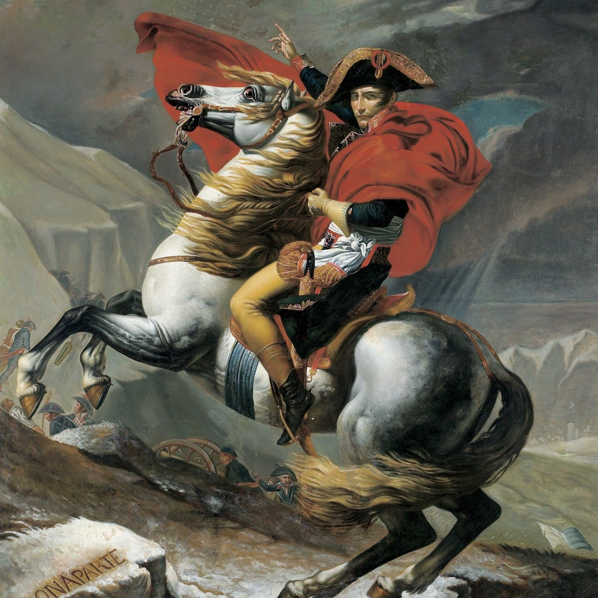

<h1 align="center">Há»c viện Công nghệ Bưu chính Viễn thông - Cơ sở TP.HCM 
    Tất cả những điều nên biết trước khi bước vào kì Thực tập và Đồ án tốt nghiệp Đại học
</h1>

    

# [**Table Of Content**](#table-of-content)
- [**Table Of Content**](#table-of-content)
- [**Introduction**](#introduction)
- [**Internship period**](#internship-period)
  - [**Middle of May to End of June**](#middle-of-may-to-end-of-june)
  - [**Start of July to End of August**](#start-of-july-to-end-of-august)
  - [**End of August to Early September**](#end-of-august-to-early-september)
  - [**The rest of September**](#the-rest-of-september)
- [**Graduation period**](#graduation-period)
- [**From Phong with love 💙**](#from-phong-with-love-)

# [**Introduction**](#introduction)
Chào các bạn đang đọc những dòng lưu bút đầu tiên này. Mình tên là Nguyễn Thành Phong. Thời điểm mình viết những dòng này thì có 
lẽ mình cũng được coi là cựu sinh viên trường rồi chỉ là chưa có bằng tốt nghiệp chính thức thôi. Như tiêu đề các bạn đã đọc ở bên trên,
 repository này **không nói về đồ án nào hết** mà tập trung vào **quá trình làm đồ án cho kì Thực tập & Đồ án tốt nghiệp Đại học**. 

Bản thân mình cũng không phải là một sinh viên dạng `con nhà người ta` gì cả 🤣🤣 nên ngay từ hồi học năm 3 mình đã đi dò hỏi 
những thông tin liên quan tới giáo viên & quá trình làm thực tập và ra trường nhằm chuân bị trước tâm lý. 
Tuy nhiên, do quen biết với các bạn chị khóa trên không nhiều nên thông tin có được rất hạn chế, mù mờ. Và mình tin các bạn đang đọc 
những dòng lưu bút này, có lẽ các bạn cũng tò mò và có sự lo lắng giống Phong vậy. 

Do đó, những điều mình sắp viết dưới đây - là những gì mình đã trải nghiệm qua - mình hi vọng sẽ giúp các bạn mường tượng ra quá trình 
nếm mật nằm gai này trước khi cầm trên tay tấm bằng tốt nghiệp Đại học - dấu mốc lớn đánh dấu sự chuyển giao giữa giai đoạn học tập & 
giai đoạn trưởng thành của mỗi con người.

Nếu các bạn thấy những điều mình viết có giá trị là hữu ích. Hãy tặng bài viết này một ngồi sao ⭐ & chia sẻ tới những người khác nha.
Hoàng đế Napoleon đã từng nói: 

    

<h3 align="center">

***"90% sự thành bại của một trận đánh phụ thuộc vào thông tin" - Napoleon***
</h3>

Los geht's! 🔥🔥🔥

# [**Internship period**](#internship-perior)

Giai đoạn đầu tiên là Thực tập. Trước khi vào chi tiết, tụi mình sẽ cùng nhau thống nhất là chúng ta vẫn đang theo học 
ở trường như bình thường nha. Tức chúng ta chưa hề đi thực tập hoặc đang đi thực tập ở đâu đó.
Trường hợp các bạn đã đi thực tập từ trước thì khỏe rồi 😎 không cần lo lắng nhiều

## [**Middle of May to End of June**](#end-of-may-to-end-of-june)

Khi các bạn học tới kì 2 của năm cuối, **từ giữa tháng 5 trở đi** nhà trường sẽ phát thông báo cho sinh viên tụi mình bắt đầu 
đăng kí địa chỉ công ty mà các bạn đang thực tập. Việc đăng kí này không có hạn chót, tức kể cả sau đó bạn rời công ty đó & 
chuyển sang chỗ khác thì bạn vẫn có thể cập nhật lại địa chỉ công ty thực tập của mình.

**Cuối tháng 6**, thời gian này chúng sẽ vừa thi hết tất cả các môn còn lại trong học kì & đến cuối tháng 6 này nhà trường sẽ 
chốt chỗ danh sách đăng kí thực tập. 

Điều quan trọng nhất ở giai này là trường hợp bạn mãi vẫn không tìm được công ty để đi thực tập thì bạn vẫn nên ghi đại tên một công 
ty nào đó vào. Vì nếu bạn không cập nhật bất kì thông tin gì vào danh sách đăng kí thực tập của nhà trường 
thì **nhà có thể coi rằng bạn bỏ học**.

Điều thứ hai là trường hợp bạn xin thư giới thiệu của nhà trường để đi xin thực tập mà mãi vẫn chưa có chỗ nào nhận thì 
chúc mừng bạn( không biết có nên mừng không nữa, thực sự mình không biết), bạn sẽ được thực tập tại trường luôn. Khỏi phải đi đâu 
cả. Tức bạn vẫn sẽ nhận đề tài & làm nó giống như những sinh viên đi thực tập ở doanh nghiệp bên ngoài.

    

<h3 align="center">

***Danh sách thực tập tốt nghiệp khóa 2018-2023 của Phong😊***
</h3>

Ngoài ra, trong quá trình đi học các bạn thấy thích giáo viên nào thì nên trao đổi trước với các thầy cô để đăng ký một suất. Điều này 
sẽ giúp các bạn chọn được giáo viên hướng dẫn theo mong muốn của mình. Nếu không, nhà trường sẽ phát bạn ngẫu nhiên vào một giáo viên 
nào đó, nói chung là hên xui😫😫. 

Bởi lẽ, không phải giáo viên nào cũng sẽ phù hợp với bạn. Nếu bạn thích được tự do thoải mái, không áp lực
thì những thầy cô như Phan Thanh Hy, Nguyễn Anh Hào,.... sẽ phù hợp hơn. Còn nếu bạn mong một thầy cô hướng dẫn tận tình, chu đáo thì nên 
chọn Lưu Nguyễn Kỳ Thư, Nguyễn Thị Bích Nguyên....

NHƯNG, một chữ nhưng to đùng😲😲, nếu bạn giống như Phong khi đó. Chỉ biết việc được đổi giáo viên khi đã có danh sách chốt 
thông tin như trên và bạn tá hỏa khi biết mình trúng phải giáo viên mà mình không thích - như Phong thì trúng cô Nguyễn Thị Bích Nguyên.
Thì chúng ta vẫn còn hi vọng nè. Hồi đó, Phong mong thầy Hào sẽ là người hướng dẫn mình vì Phong cảm thấy phong cách làm việc của thầy
chu đáo và cẩn thận hơn. 

Để xin được đổi giáo viên. Đầu tiên, các bạn cần liên lạc với giáo viên mình mong muốn đổi để xem thầy cô đó có đồng ý nhận bạn hay không? 
Nếu thầy cô đó đồng ý nhận hướng dẫn bạn😘 thì bước thứ 2 là bạn cần liên lạc với giáo viên mà mình bị phân công để xin sự đồng ý từ họ.
Nói chung là bạn phải có sự đồng ý từ cả 2 phía. Sau đó, bạn sẽ báo lại cho giáo viên đồng ý nhận bạn để nhanh nhà trường tiến hành cập 
nhật lại danh sách và bạn sẽ nhận đề tài từ giáo viên mới. 

Vậy là xong ✔. Chúc mừng bạn đã làm được giống Phong. Bạn đã đổi được giáo viên phù hợp với mình.

Ngoài ra, đề tài thực tập cũng là một điểm đáng lưu ý. Các bạn có thể đề xuất hoặc nói thô hơn là chọn đề tài mình mong muốn làm. 
Ví dụ bạn muốn làm kiểu website thương mại điện tử, blah blah,.... chẳng hạn😋😊(Đề tài bán hàng muôn thuở ghê). 

Việc cần lúc này là bạn trình bày kĩ với giáo viên hướng dẫn mình về những tính năng, công nghệ bạn dùng,....Kế tiếp, giáo viên sẽ 
xem xét và thêm một số yêu cầu nhỏ cho phù hợp và bạn sẽ được làm đề tài đó. Nếu bạn làm bán hàng nhiều & đã có kinh nghiệm thì 
điều này khá khỏe.🥱🥱Quan trọng nhất là phải chốt đề tài thật nhanh để tránh việc không kịp thời gian, bạn sẽ phải làm đề tài do 
thầy cô đó giao và có thể nó không đúng sở trường của bạn😨😨.

## [**Start of July to End of August**](#start-of-july-to-end-of-august)

**Bắt đầu từ đầu tháng 7** thì chúng ta sẽ bắt tay làm đồ án thực tập. Lúc này thì bạn chỉ còn việc làm đồ án cho tốt thôi. 

Giai đoạn này có lẽ điều thử thách chúng ta nhất chính là sự mệt mỏi nếu bạn đi thực tập ở doanh nghiệp bên ngoài. Bạn làm việc fulltime,
 ví dụ như Phong là từ 9h sáng đến 6h tối chẳng hạn😭😭, thực sự là khi về tới nhà có thể bạn sẽ rất mệt mỏi rồi. Huống chi, bây 
 giờ bạn mới có thời gian để làm đồ án thực tập của mình nữa. 

Lúc này có thể xảy ra 2 lựa chọn: 

**Lựa chọn 1**: bạn làm đề tài đó từ đầu như Phong
✅ Ưu điểm:
+ Nỗ lực thực sự nên kinh nghiệm & kiến thức là của bạn 
+ Là bước chuẩn bị, mài giũa tinh thần để bạn có thể tiến tới làm Đồ án tốt nghiệp với áp lực và khối lượng công việc lớn hơn 💪

❎ Nhược điểm:
+ Mệt mỏi hơn, vất vả hơn 
+ Có thể không hoàn thành hết tất cả các yêu cầu nếu hiệu suất làm việc không cao => điểm không cao
+ Thời gian làm đồ án có thể ít hơn do phải đi làm fulltime tại đơn vị thực tập( nếu bạn phải đi làm full time)

**Lựa chọn 2**: bạn lấy một đồ án môn học đã từng làm có chức năng tương đương hoặc đồ án của người khác
✅ Ưu điểm:
+ Nhàn hơn, đỡ vất vả hơn, có thời gian nghỉ ngơi nhiều hơn,...
+ Khối lượng công việc không nhiều 

❎ Nhược điểm:
+ Nếu trúng phải thầy cô khó tính như Lưu Nguyễn Kì Thư, bạn có thể bị phát hiện sử dụng bài của người khác và bị rớt thực tập 
+ Bạn có thể sẽ bị ngợp hơn nếu làm Đồ án tốt nghiệp

Chọn phương án nào là phụ thuộc vào bạn và cả giáo viên hướng dẫn của bạn. Nếu gặp giáo viên dễ tính thì chỉ cần bạn hiểu được yêu cầu
 và nộp ra sản phẩm đáp ứng được kì vọng của giáo viên thì sẽ qua ải. 

Nếu gặp những giáo viên khó tính như thầy Thư hay cô Nguyên thì có vẻ lựa chọn 2 không phù hợp với bạn cho lắm. Bởi lẽ các thầy 
cô này thường sẽ meeting mỗi cuối tuần về những thứ bạn đang làm nên nếu lấy bài của người khác thì bạn chắc chắn sẽ bị phát hiện và 
rớt thực tập. Đặc biệt là thầy Thư, dường như ông thầy này bị dị ứng với việc đi chép bài người khác thì phải 😆.

Ngoài ra cũng tùy thuộc vào giáo viên mà chúng ta sẽ phải báo cáo hàng tuần hoặc không. Như Phong thì mình tự giác báo cáo hàng tuần 
cho thầy Hào kể cả khi thầy không phản hồi lại. Còn lại thì như đoạn bên trên, các thầy cô bắt buộc các bạn phải tham gia họp cuối tuần 
để báo cáo những gì bạn đã làm được trong 1 tuần vừa rồi

Mình đã có ghi trong đồ án thực tập một số những gì mình biết về các giáo viên hướng dẫn, các bạn 
có thể xem tại [**đây**](https://github.com/Phong-Kaster/PTIT-Do-An-Thuc-Tap#mentor)

**Đến cuối tháng 8** có lẽ các bạn tầm này đã gần hoàn thiện đồ án thực tập của mình rồi. Hãy chuẩn bị 
cho giai đoạn kết của quá trình thực tập nào😛😛

## [**End of August to Early September**](#end-of-august-to-early-september)

Giai đoạn này kéo tài từ 1-2 tuần, các bạn sẽ bắt đầu được chấm thi bởi 2 giáo viên: giáo viên hướng dẫn & 
giáo viên phản biện bất kì.

Đại khái tới được giai đoạn này thì bạn có thể coi là gần như đã qua môn rồi. Chỉ còn vấn đề là điểm 
cao hay là thấp thôi 🔺 🔻. 

Thông thường thì giáo viên hướng dẫn dù khen hay chê cũng sẽ cho bạn điểm cao hơn. Còn với giáo viên phản biện thì 
đúng là hên xui. Nếu gặp thầy cô khó thì bạn toang và điểm của giáo viên phản biện dường như quyết định 
kết quả chung cuộc sau 2 tháng rưỡi nỗ lực của bạn. 

Ví dụ như thầy Nguyễn Anh Hào, nếu được thầy hướng dẫn làm đồ án thực tập và tốt nghiệp thì phải nói là 
hết nước chấm ⭐⭐⭐⭐⭐. Nhưng thầy sẽ trở thành ác mộng nếu là người chấm phản biện của bạn. 
Hầu như từ bạn bè, Phong nghe thấy nhiều bạn bị 3-4 điểm thực tập đều do thầy Hào chấm, thậm chí 
có trường hợp rớt đồ án thực tập luôn 💥. Nếu rớt thực tập thì khá là mệt vì bạn sẽ phải học lại 
sang năm và tốt nghiệp muộn hơn.

Các bạn có thể đọc thêm về hình thực thi cử thêm tại [**đây**](https://github.com/Phong-Kaster/PTIT-Do-An-Thuc-Tap#examination)

## [**The rest of September**](#the-rest-of-september)

Giai đoạn này bạn có khoảng 2 tuần để xả hơi trước khi đi tiếp chặng cuối đề về đích. Vì vậy hãy nghỉ ngơi đi 🤍

# [**Graduation period**](#graduation-period)

# [**From Phong with love 💙**](#from-phong-with-love)